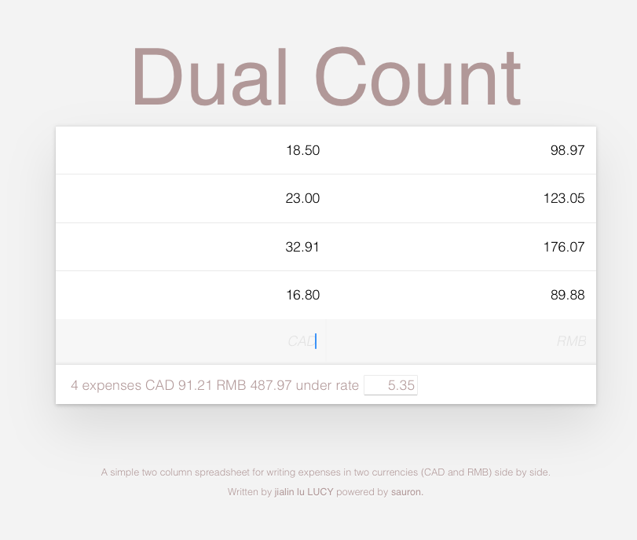

# Dual Money counter

For personal use, write down CAD and RMB expense side by side and calculate. It becomes useful as I am using WeChat accounting mini app to record expense but majority of my expense is in Canadian dollar.

  

Note that as I am lazy, the compiled Wasm is simply uploaded in the repo `pkg/`
